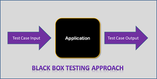
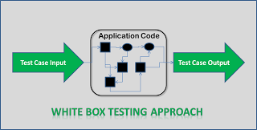
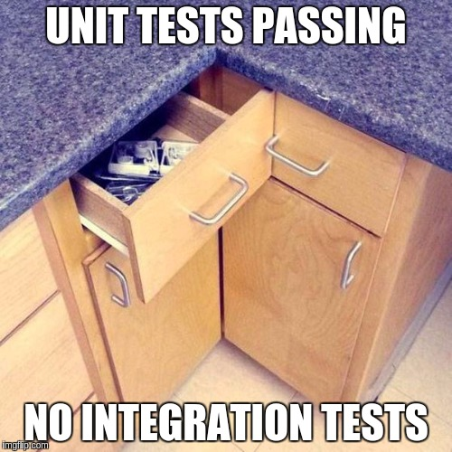
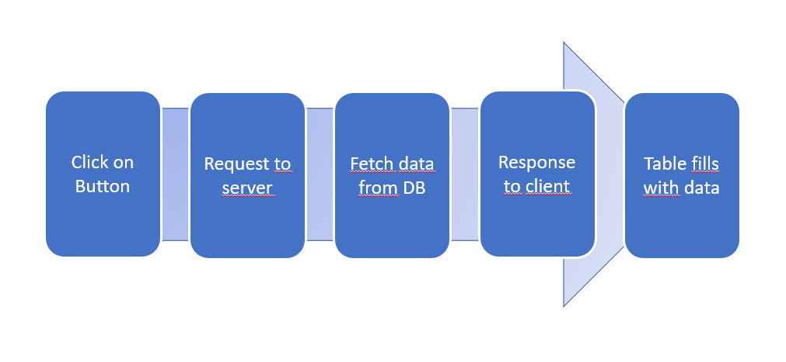

# Tests

note: 
Ziel: Herausfinden ob Softwarefehler enthält
Was ist ein Softwaretest? 

--

## Definition Softwaretest

>"Programm testing can be used to show the presence of Bugs, but never their absence"

Edsger W. Dijkstra

note: 
- Testen = stichprobenartiges Prüfen
- keine Verifikation, d.h. Korrektheit durch logische Schlussfolgerung beweisen
- Ziel, vollständige Testabdeckung
- Problem, wie werden Tests ausgeführt? durchklicken oder automatisiert

-- 

## Black Box Tests



*Beispiel mit Code*

***
[White Box Testing and Black Box Testing in Software Testing](https://www.testing-whiz.com/blog/understanding-white-box-testing-and)<!-- .element: style="font-size: 25px" -->


note:
- Wie immer im Software Engeneering gibt es Black & White Boxes
- Im Grunde hat der Tester (wer auch immer das ist) keine Ahnung, wie das System implementiert ist
- Es werden nur die Spezifikationen genommen und daraus Testcases erstellt und in das Programm reingeworfen
- Dann macht das Programm etwas (was genau ist dem Tester egal)
- Und am Ende kommt ein richtiges oder falsches Ergebniss
- Das ganze kann manuell explorativ sein, oder automatisiert
- Es gibt auch negativ Cases
- Man kann Grenzwertanalyse machen (Beispiel?)
- Man kann Equivalenzklassen nutzen 
- Man kann Fehler raten
- Also alles in allem ziemlich Funktional

-- 


## White Box Tests



*Beispiel mit Code*

***
[White Box Testing and Black Box Testing in Software Testing](https://www.testing-whiz.com/blog/understanding-white-box-testing-and)<!-- .element: style="font-size: 25px" -->

note:
- Offensichtlich das Gegenteil
- Tester kennt das System und entwickelt anhand der genauen implementierung Testcases
- Dazu muss er das System analysieren und verstehen und schreibt Cases um jede Zeile zu testen
- Tester schaut, welche Stellen fehleranfällig sein können
- Controllflow tests usw.

-- 


## Arten von Tests

--

## Unit Test

```Java
public class Calculator{

    public static int add(int x, int y){ 
     return x + y; 
    }

    public static int divide(int dividend, int divisor){ 
     return dividend / divisor;
    }

}
``` 
<!-- .element: class="fragment" width="200px"-->

```Java
@Test
public void addTest(){
    int actual = Calculator.add(1, 2);
    Assert.AreEqual(3, actual);
}
```
<!-- .element: class="fragment" width="200px"-->

note:
- Testen einer Komponente der Software
- Ziel: fehlerfreie Funktion jeder einzelnen Komponente
- Black-Box Test
--

## Was zeichnet gute Unit Tests aus

- sind isoliert <!-- .element: class="fragment" -->
- sichern jeweils genau eine Eigenschaft ab <!-- .element: class="fragment" -->
- sind leicht verständlich und kurz <!-- .element: class="fragment" -->
- testen relevanten Code <!-- .element: class="fragment" -->
- weisen genauso hohe Code Qualität auf, wie der Produktiv Code selbst <!-- .element: class="fragment" -->

note: 
- Tests sollen in beliebiger Reihenfolge ausführbar sein
- Falsches Verhalten soll sich nur an einer Stelle zeigen
- leicht verständlich, unterstützt Dokumentation
- keine Getter und Setter testen
--

## Integration Test

<!-- .element: height="350px" -->

***
[https://chriskottom.com/images/unit-tests-passing-no-integration-tests.jpg](https://chriskottom.com/images/unit-tests-passing-no-integration-tests.jpg)<!-- .element: style="font-size: 25px"-->

note:
- Integrationstests prüfen ob Komponenten richtig zusammenarbeiten
- Prüfen ob die Logik funktioniert wie geplant
- Testen der Kopplung der Komponenten
- System wird als White-Box betrachtet
- Jede Systemkomponente muss zuvor getestet werden
- Ziel: Fehlerfreies zusammenwirken der Systemkomponenten

--
## End-to-End Test



note: 
- Prüfen wie sich die Software unter real Bedingungen verhält
- Häufig Performance Tests
- Testen aus der Nutzer Perspektive
- am besten ausführen für alle Use Cases die einem einfallen
- stellt sicher das Programm bereit ist ausgeliefert zu werden

--

## Testautomatisierung

<!-- .element: height="300px" -->

***
[https://www.isg-stuttgart.de/fileadmin/_processed_/csm_Fotolia_131459855_L_Testautomatisierung_55885ae42f.jpg](https://www.isg-stuttgart.de/fileadmin/_processed_/csm_Fotolia_131459855_L_Testautomatisierung_55885ae42f.jpg)<!-- .element: style="font-size: 25px" -->

note:
- Ausgangssituation: (symbolische Ausführung) Entwickler klickt sich vor commit durch einen Ablauf um zu prüfen ob alles noch funktioniert
- Problem: Sehr Fehler anfällig -> nicht alle Fehler werden erkannt
- Lösung: Tests werden automatisiert -> Ergebnisse auf Knopfdruck
- Vorteile: 
erleichtert das Testen in Druckphasen eines Projektes
Feedback auf Knopfdruck

--

## Automatisierungs Pyramide

<!-- .element: height="350px" -->

***
[https://encrypted-tbn0.gstatic.com/images?q=tbn:ANd9GcQrgB1E6r9R5Sjj2he_81PxP_MkHG5y_XXSiW9M1jx6DmYNPdjHzw](https://encrypted-tbn0.gstatic.com/images?q=tbn:ANd9GcQrgB1E6r9R5Sjj2he_81PxP_MkHG5y_XXSiW9M1jx6DmYNPdjHzw)<!-- .element: style="font-size: 25px"-->

note:
- Unit Tests sind die billigsten Tests
- sie sollen während der Entwicklung immer wieder ausgeführt werden
- Integration tests ausführen wenn zuvor getesteter Code abgeändert wird
- Mid Layer, immer hier automatisieren anstatt in der UI
- UI Layer, am wenigstens tests, da diese die aufwändigsten Tests sind


---

# Praktische Erfahrungen

---

# Frameworks

note:
- Helfen bei der Programmierung von Tests
- Beschreiben was eine Komponente macht, nicht wie sie es macht

## Property Based Testing

```Haskell
    describe "reverse" $
      it "returns the original list if applied twice" $
        \list -> reverse (reverse list) `shouldBe` list
```

note:
- Problem mit Standard-Tests: Welche Fälle werden behandelt, welche werden vergessen
- Zufallsdaten helfen, aber sind auch nicht perfekt
- Wäre es nicht super, wenn man **Eigenschaften** überprüfen kann?
- Property based testing hilft

---

# Pattern

-- 

## Mocks

 

***
[http://www.dotnetcurry.com/images/mvc/ASP.NET-MVC-Testing-Testing-Model-Separa_64AA/mocking.png](http://www.dotnetcurry.com/images/mvc/ASP.NET-MVC-Testing-Testing-Model-Separa_64AA/mocking.png)<!-- .element: style="font-size:25px" -->

note:
- bedeutet "vorgetäuscht"
- simulieren des verhaltens von realen Objekten, die sich schlecht im Unit Test einbinden lassen
- z. Bsp. Dateien, Daten, Uhrzeit
- Unit Tests sollen in beliebiger Reihenfolge ausgeführt werden können

--

## Pattern im Code

*Beispiele**

---

# Ergebnisse & Probleme

note:
- Das Test sinnvoll sind, haben bestimmt alle verstanden
- Mit den hier gezeigten Pattern, kann man auch ganz gut implementieren und testen
- Aber es gibt auch Probleme:
    1) *Kurs fragen* Wer testet? Wer mag testen?
       Generell macht testen einfach keinen Spaß... ich will entwickeln
       Da fehlt Befriedigung etwas zu erreichen
    2) Was ist die Motivation zu testen? Was ich schreibe funktioniert doch, dass **weiß** ich!
    3) Funktion sieht schwer testbar aus... aber die funktioniert bestimmt, also teste ich nicht

--

## Was macht der Test?

``` kotlin
    @Test
    fun `deleteAll deletes all fields from db`() {
        // Given: some fields in the db
        val fieldsInDb = createRandomFields()
        fieldsAccessor.insert(fieldsInDb)
        
        // When: we delete all fields
        fieldsAccessor.deleteAll()
        
        // Then: there are non left
        val fieldsLeft = fieldsAccessor.getAll()
        fieldsLeft should beEmpty
    }
```
<!-- .element: class="fragment" -->


``` kotlin
    fun getAll() {
        // hm... these are not fields
        return database.allProcesses()
    }
```
<!-- .element: class="fragment" -->

note:
- Es kann auch Tests geben, die eigentlich gar nichts bringen
- Hier ein Beispiel von meiner Arbeit
- *Test erklären*
- Der Test sieht eigentlich gut aus... aber die zu testene Funktion konnte man auskommentieren
- In der Implementierung sieht man, dass der Test in Wahrheit überhaupt nichts testet
- Das ist ein Fall, den man unbedingt vermeiden muss

--

note: 
- T: Fehler werden übersehen
    
- D: Warum Testen, das funktioniert
- D: Macht der Tests wirklich etwas?
- D: Code untestbar geschrieben
- D: Wer muss Tests schreiben? -> Tests sucken
- T: Externes Team ist schlecht
    externe Teams sind billiger
    Personalaufwand
    Testteam nervt -> Entwickler haben weniger Spaß
- T: Geringe Testabdeckung ist schlechter als gar keine Tests
    geben das gefühl man hätte etwas getestet, dass ist aber nicht wirklich so
    viele Tests bleiben unentdeckt