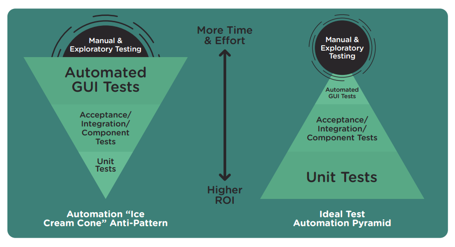
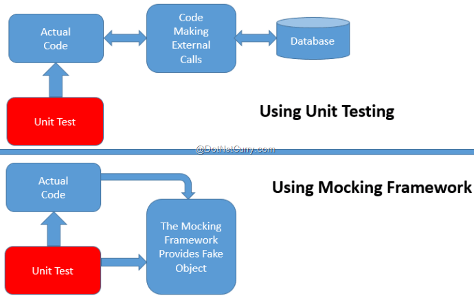

# Klassischer Ansatz

note: 
Wie wird aktuell getestet?

---

# Tests

note: 
Ziel: Herausfinden ob Softwarefehler enthält
Was ist ein Softwaretest? 

--

## Definition Softwaretest

>"Programm testing can be used to show the presence of Bugs, but never their absence"

Edsger W. Dijkstra

note: 
- Testen = stichprobenartiges Prüfen
- keine Verifikation, d.h. Korrektheit durch logische Schlussfolgerung beweisen
- Ziel, vollständige Testabdeckung
- Problem, wie werden Tests ausgeführt? durchklicken oder automatisiert

-- 

## Black Box vs. White Box


note: 
Whitebox: Einblick in das zu testende Programm ist vorhanden, Entwicklersicht
Blackbox: Kein Einblick in das getestete Programm, Anwendersicht 
Sollten Tests nach Black- oder White-Box Prinzip verarbeitet werden?
Im TDD werden zu Beginn Blackbox Tests geschrieben

-- 

## Arten von Tests

- Unit
- Integration
- System
- End-to-End Test

--

## Komponenten Test

- Testen einer Komponente unseres Programms
- Ziel: fehlerfreie Funktion jeder einzelnen Komponente
- White-Box Test?

note:
Problem, was ist eine Einheit? Objektorientierung Klassen kleinste Einheit

--

## Integration Test

- Testen der Kopplung der Komponenten
- Jede Systemkomponente muss zuvor getestet werden
- System wird als White-Box betrachtet

note:
Testen der Schnittstellen einer Komponente
Ziel: Fehlerfreies Zusammenwirken der Systemkomponenten
Vorrausetzung: Jede Systemkomponente muss zuvor getestet werden, Unit Test
System wird als White Box Betrachtet

--

## System Test

- Prüfen ob das System als ganzes funktioniert
- Integrationstest für das vollständige System muss abgeschlossen sein
- System wird als Black Box betrachtet

note:
Prüfen ob das System als ganzes funktioniert
Vorraussetzung: 
Pflichtenheft
Integrationstest für das vollständige System ist abgeschlossen
System wird als Black Box betrachtet    

--

## End-to-End Test

- Zeigen dem Kunden, dass das System funktioniert 
- Betrachten des Systems als Black-Box

note: 
Auch Abnahme Test? 
Prüfen ob die UI sich so verhält wie es erwartet wird.

--

## Testautomatisierung


note:
Ausgangssituation: (symbolische Ausführung)Entwickler klickt sich vor commit durch einen Ablauf um zu prüfen ob alles noch funktioniert
Problem: Sehr Fehler anfällig -> nicht alle Fehler werden erkannt
Lösung: Tests werden automatisiert -> Ergebnisse auf Knopfdruck
Vorteile: 
erleichtert das Testen in Druckphasen eines Projektes
Feedback auf Knopfdruck

--

## Anti Pattern Testautomatisierung



note:
- 

---

# Frameworks

note:
- Helfen bei der Programmierung von Tests
- Beschreiben was eine Komponente macht, nicht wie sie es macht

-- 

## JUnit

- Jede Klasse erhält eine Testklasse 
- Annotation @Test zum kennzeichnen eines Tests

note: 
Java

-- 

## Beispiel JUnit

```Java
public class Calculator{

    public static int Add(int x, int y){ 
     return x + y; 
    }

    public static int Divide(int dividend, int divisor){ 
     return dividend / divisor;
    }

}
``` 

-- 

## Beispiel JUnit

```Java
public void AddTest(){
    int x = 1;
    int y = 2;
    int expected = 3;
    int actual = Calculator.Add(x, y);
    Assert.AreEqual(expected, actual);
}
```

note: 
Code Example
Testen ob eine Einheit ihre Funktion erfüllt
Unit Tests sollen die Ergebnisse anderer Unit Tests nicht beeinflussen
Was ist eine Unit?

-- 

## Jasmine

Tests schreiben:

describe: suit
it: spec
expect: matcher

note: 
JavaScript

-- 

## Jasmine Example

```JavaScript
    function helloWorld() {
     return "Hello world!";
    }
```

--

## Jasmine Example

```JavaScript
    describe("HelloWorld", function(){
     it("says hello", function(){
      expect(helloWorld()).toEqual("Hello world!");
     })
    })
```

--

## Property Based Testing

---

# Pattern

-- 

## Mocks

 

note:
- bedeutet "vorgetäuscht"
- primär in unit tests
- simulieren des verhaltens von realen Objekten, die sich schlecht im Unit Test einbinden lassen
- z. Bsp. Dateien, Daten, Uhrzeit

---

# Ergebnisse & Probleme


note: 
- T: Fehler werden übersehen
- D: Warum Testen, das funktioniert
- D: Macht der Tests wirklich etwas?
- D: Code untestbar geschrieben
- D: Wer muss Tests schreiben? -> Tests sucken
- T: Externes Team ist schlecht
    Personalaufwand
    Testteam nervt -> Entwickler haben weniger Spaß
- T: Geringe Testabdeckung ist schlechter als gar keine Tests
    geben das gefühl man hätte etwas getestet, dass ist aber nicht wirklich so