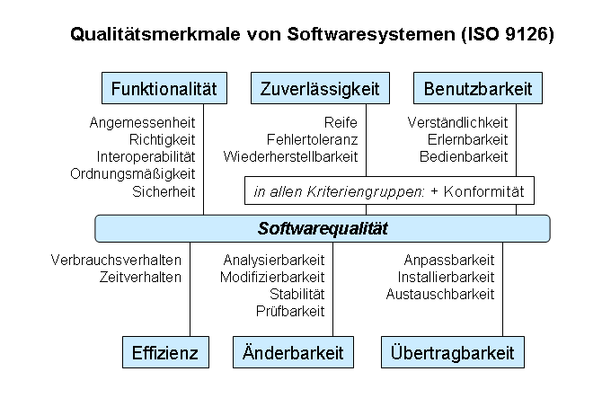
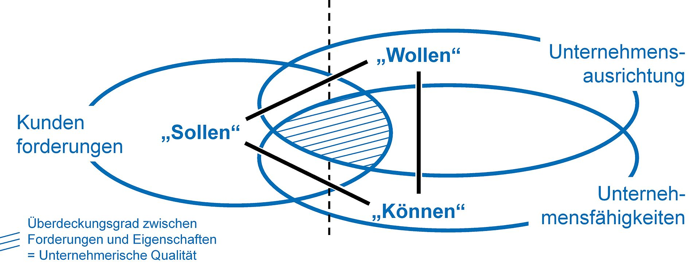

# Motivation

---

# Softwarequalität

note: Warum wollen wir Softwarequalität

-- 

## Auswirkungen von Softwarefehlern

note:
US-Bundesverwaltung: Bericht des obersten Rechnungshofes über neue Projekte (1986):
27% der bezahlten Software wurde nie geliefert
52% funktionierten nie
18% kamen erst nach aufwändigen Sanierungen zum Einsatz
3% erfüllen die vereinbarten Vertragsbedingungen
->Wir brauchen Softwarequalität, nur was ist das?

--  

## Definition Qualität

note: 
Qualität ist ein relativer Begriff
ISO 9000: Grad, in dem ein Satz inhärenter Merkmale eines Objektes Anforderungen erfüllt
Qualitätsansätze nach Garvin, tranzendent-, produkt-, kunden-, wert-, fertigungsbezogen 
-> Wie lässt sich das auf Softwarequalität übertragen

--

## Definition Softwarequalität

note: 
Ansatz ISO 9126

-- 

## Qualität aus Unternehmenssicht

note:
- Qualität kostet Geld
- Kunden bemerken fehlende Qualität
- Gute Qualität -> Kunde ist zufrieden -> Kunde kommt zurück (Herman Tietz?)

-- 

## Qualität aus Entwicklersicht

note: 
- Wir sehen warum Unternehmen Quality wollen
- Warum will ich das als Entwickler?
- Wenn ich einfach nur programiere, entseht schlechter Code.
- Schreibe etwas bis es funktioniert
- Funktion macht 20 Sachen
- Um das zu umgehen brauche ich Disziplin
- Test helfen, es geht aber auch ohne