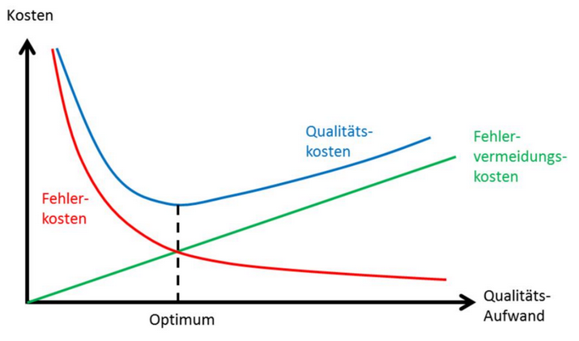

# Motivation

note: 
Warum wollen wir Softwarequalität?
- Software in fast allen Bereichen des täglichen Lebens
- Drucker, Ampeln, Raketen etc.

-- 

## Auswirkungen von Softwarefehlern

<!-- .element: height="300px" -->

***
[http://www.zeit.de/gesellschaft/zeitgeschehen/2017-11/american-airlines-computerfehler-piloten-weihnachtstage](http://www.zeit.de/gesellschaft/zeitgeschehen/2017-11/american-airlines-computerfehler-piloten-weihnachtstage)<!-- .element: style="font-size: 20px" -->

note:
- Fehler kosten Geld
- Qualität kostet aber auch Geld

-- 

## Wann lohnt sich Qualität?



***
Folie 38 Softwarequalität Dr. Karsten Brünig<!-- .element: style="font-size=20px" -->

note:
- Kunden bemerken fehlende Qualität
- Vorhandene Qualität fördert Kundenbeziehung

-- 

## Wenn man Bugs fixen muss


***

[http://i0.kym-cdn.com/photos/images/original/000/146/308/1310190179002.jpg](http://i0.kym-cdn.com/photos/images/original/000/146/308/1310190179002.jpg)<!-- .element: style="font-size: 20px" -->

note: 
- Wir wissen jetzt, dass Tests für das **Prodult** wichtig sind, aber was ist mit mir als Entwickler?
- *Kurs fragen* Wer entwickelt gerne neue Sachen? We fixt gerne Bugs. *Erzählen, dass ich lieber entwickle als Bugs zu fixen*
- überleitung auf nächste Folie: Aber was ist noch schlechter als Bugs zu fixen?

--

## Wann man Bugs in schlechtem Code fixen muss

``` java
    public class ... {
        // Hier ein Beispiel für schlechten Code einfügen
    }
```
