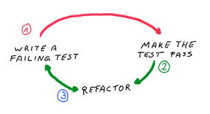
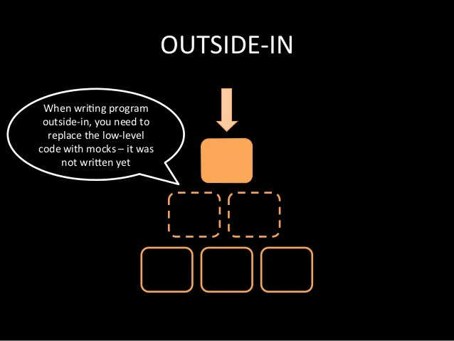
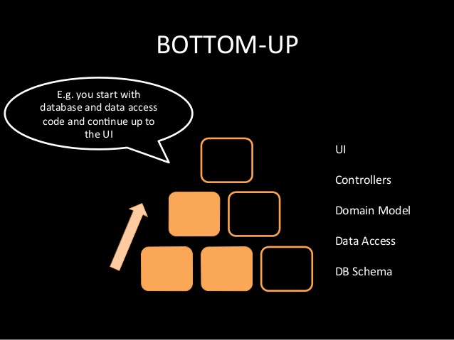

# Test Driven Development

note: 
Hauptthema der Präsentation

---

# Theorie

note: 
- Software Entwicklungs Prozess
- Besteht nicht nur aus Test zu erst schreiben -> Das ist Test First
- Designstrategie

--

## TDD Zyklus

note: 
1) Write a Test -> Was soll meine Komponente machen
2) Make the Test pass -> Implementierung der Komponente
3) Refactor

--

## 3 Goldene Regeln

>1) You can't write any production code until you have first written a failing unit test.

>2) You can't write more of a unit test than is sufficient to fail, and not compiling is failing.

>3) You can't write more production code than is sufficient to pass the currently failing unit test. 

note: 
Hier sollen die Regeln nacheinander angezeigt werden
Fehler werden automatisch aufgedeckt

--

## Greybox 

---

# Beispiel

Primfaktoren ala Uncle Bob

---

# Pattern

note: 
- Testbarer Code
- Entwicklung Bottom Up, Top-Down

--

## Top-Down TDD

note: 
System analysieren?
Was soll mein System machen?

--

## Bottom-Up TDD

note:
Einzelne Komponenten des Systems beschreiben. 
Am Ende zusammensetzen.
Evolutionäres Prototyping?

---

# Praktische Erfahrungen

note: 
- TDD gegen nicht testen 
    - HTML Clients im Arsch
- Wie strikt wird es eingehalten?
    - Compilierfehler
    - Random Daten erzeugen (siehe Property based)
    - Was wird getestet?
- Große Probleme am Anfang
- Erfahrungen IBM 
    - Dauert ~10% länger
    - Aber 50% weniger Defects

---

# Ergebnisse und Probleme

note: 
- Was ist eine Unit?
- Anforderungen werden verstanden
- Anfang ist schwer, Neue Frameworks extrem schwer
- BDD
