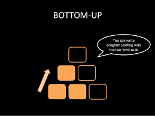
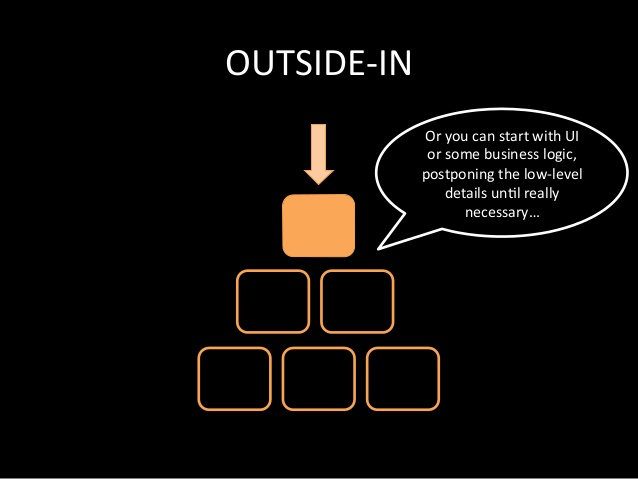
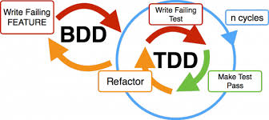
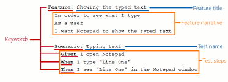

# Test Driven Development

note: 
- Um die eben genannten Probleme zu lösen wurde ein neuer Ansatz gesucht
- Erst alle Tests, dann die Klasse
- Welche Antworten will ich haben? vs. Welche Fragen stelle ich?

--

## TDD Zyklus

 <!-- .element: height="350px"-->

***
[TDD - so einfach und doch so schwer, Daniel Zappold](https://improuv.com/blog/daniel-zappold/tdd-so-einfach-und-doch-so-schwer)<!-- .element: style="font-size: 20px" -->

note: 
- Schritt 1 gibt klaren Fokus, Großes Problem in Teilschritte zerlege
- Schritt 2 Code erfüllt, Test so einfach wie möglich bestehen
- Lösungen aus Schritt 2 sind häufig nicht schön -> nicht generisch zum Beispiel
- Schritt 3 anpassen der Code und Teststruktur das Design optimiert wird

--

## 3 Goldene Regeln

1) You can't write any production code until you have first written a failing unit test. <!-- .element: class="fragment" height="100px"-->

2) You can't write more of a unit test than is sufficient to fail, and not compiling is failing. <!-- .element: class="fragment" height="100px"-->

3) You can't write more production code than is sufficient to pass the currently failing unit test. <!-- .element: class="fragment" height="100px"-->

***
[The Three Laws of Test-Driven-Development, Uncle Bob](http://programmer.97things.oreilly.com/wiki/index.php/The_Three_Laws_of_Test-Driven_Development)<!-- .element: style="font-size:20px" -->

note: 
Vorteile
- Debugging
- Courage
- Documentation
- Design
- Professionalism

--

## Greybox 

---

# Beispiel

- `primeFactors` nimmt eine Ganzzahl
- `primeFactors` gibt eine Liste von Ganzzahlen zurück
- `primeFactors` berechnet Primfaktoren

--

``` kotlin
    "1 has no prime factors" {
        primeFactors(1) 
    }
```

``` kotlin 
    fun primeFactors(n: Int): List<Int> = TODO()
```
<!-- .element: class="fragment"-->

--

``` kotlin
    "1 has no prime factors" {
        primeFactors(1) shouldEqual emptyList()
    }
```

``` kotlin 
    fun primeFactors(n: Int): List<Int> = emptyList()
```
<!-- .element: class="fragment"-->

--

...

---

# Ansätze
--

## Bottom-Up TDD

<!-- .element: height="350px" -->

***
[https://image.slidesharecdn.com/tddcommented-130125160145-phpapp01/95/tdd-outsidein-4-638.jpg?cb=1383700832](https://image.slidesharecdn.com/tddcommented-130125160145-phpapp01/95/tdd-outsidein-4-638.jpg?cb=1383700832)<!-- .element: style="font-size: 20px" -->

note:
- Beginn bei Datenmodelierungsebene
- Keine Mocks benötigt


--

## Outside-In TDD

<!-- .element: height="350px" -->

***
[https://image.slidesharecdn.com/tddcommented-130125160145-phpapp01/95/tdd-outsidein-6-638.jpg?cb=1383700832](https://image.slidesharecdn.com/tddcommented-130125160145-phpapp01/95/tdd-outsidein-6-638.jpg?cb=1383700832)<!-- .element: style="font-size: 20px" -->

note: 
- Entwicklung von Nutzungsebene ab
- Mocks werden sehr oft benötigt

---

# Praktische Erfahrungen

- Wie strikt wird TDD eingehalten?<!-- .element: class="fragment" -->
- Aller Anfang ist schwer<!-- .element: class="fragment" -->
- Erfahrungen IBM <!-- .element: class="fragment" -->

note: 
- TDD gegen nicht testen 
    - HTML Clients im Arsch
- Wie strikt wird es eingehalten?
    - Compilierfehler
    - Random Daten erzeugen (siehe Property based)
    - Was wird getestet?
- Große Probleme am Anfang
- Erfahrungen IBM 
    - Dauert ~10% länger
    - Aber 50% weniger Defects

---

# Ergebnisse und Probleme

- Anforderungen werden verstanden<!-- .element: class="fragment" -->
- Keine unnötigen Funktionen werden implementiert <!-- .element: class="fragment" -->
- Jede Zeile Code ist getestet <!-- .element: class="fragment" -->

note: 
- Anforderungen werden verstanden
- Unit Tests helfen bei der Dokumentation, indem sie beabsichtigte Verwendungen und Reaktionen aufzeigen

---

# Ausblick BDD

<!-- .element: height="300px"-->

***
[http://blog.apollossc.com/wp-content/uploads/2017/11/bdd2.png](http://blog.apollossc.com/wp-content/uploads/2017/11/bdd2.png)<!-- .element: style="font-size: 20px" -->

note:
* Erweiterung von TDD
* Tests für Kunden verständlich sein
* Kunde beschreibt Feature
* In TDD wird aus Feature abgeleitetes Szenario in Testfall umgewandelt

-- 

## Beispiel

<!-- .element: height="300px"-->

***
[BDD TESTING WITH TESTCOMPLETE, SmartBear Software](https://support.smartbear.com/articles/testcomplete/bdd-testing-with-testcomplete/)<!-- .element: style="font-size: 20px" -->